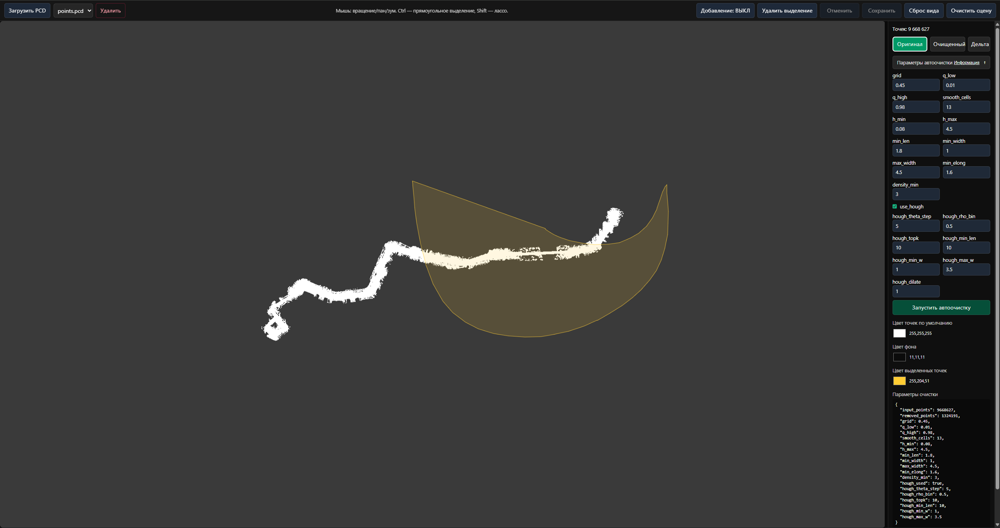
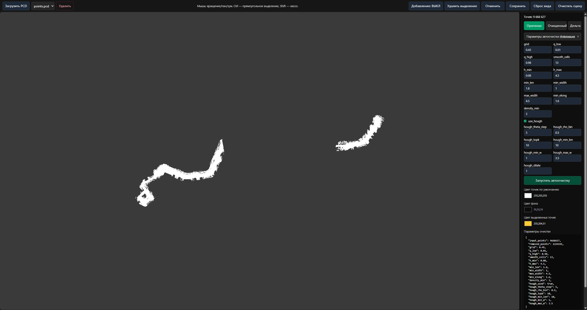
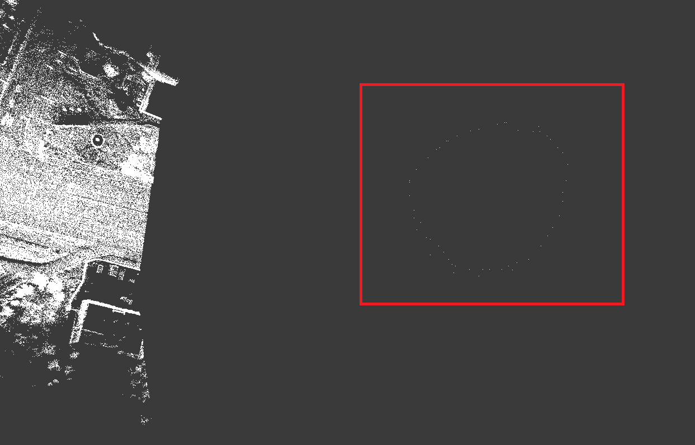
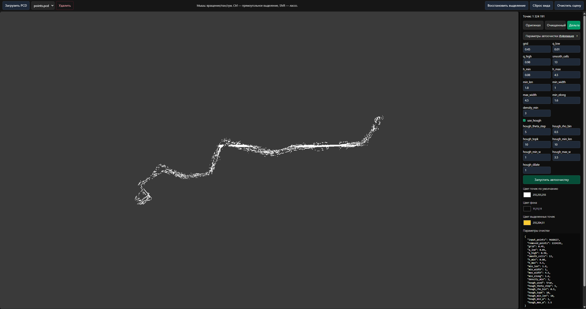
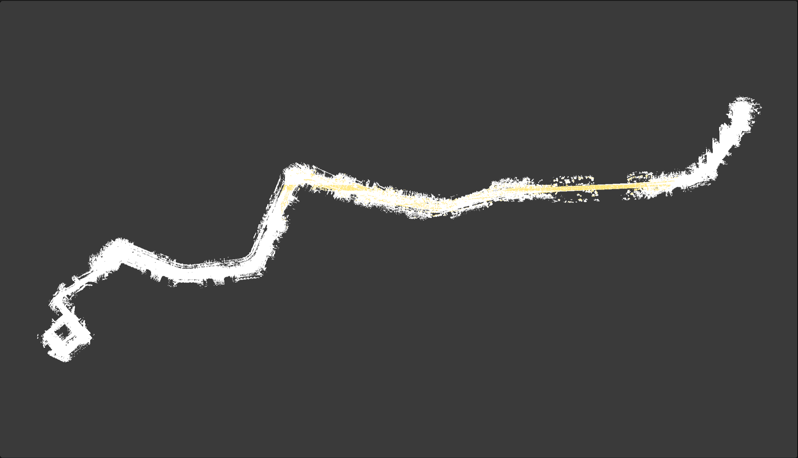

# PCD — веб‑приложение для визуализации, очистки и редактирования облаков точек (PCD)

Интерактивное full‑stack приложение для работы с файлами формата PCD: загрузка и хранение, 3D‑просмотр, полуавтоматическая очистка на сервере и ручное редактирование (выделение/удаление/добавление точек) прямо в браузере. Под капотом: трёхмерный просмотр на базе three.js, бэкенд на FastAPI, хранение в S3‑совместимом объектном хранилище (MinIO), алгоритмы на Python/Open3D.

## Тестирование приложения

**Протестировать сервис возможно на [данном стенде](http://iosefka.ru), однако его использование не рекомендуется при необходимости работы с большими PCD файлами в связи с небольшими мощностями севера.**

## Возможности приложения
- **Загрузка .pcd**: при выборе файла он мгновенно отображается локально (без ожидания), а загрузка на сервер идёт в фоне.
- **3D‑просмотр облака точек**: вращение, панорамирование, масштабирование; автоматическая подгонка камеры под модель; поддержка облаков без цветов (автогенерация цвета).
- **Выделение и редактирование**:
  - **Прямоугольное выделение** (Ctrl+перетаскивание) и **лассо** (Shift+рисование) с подсветкой выбранных точек.
  - **Удаление выделенных точек** и **отмена последнего удаления** (одноуровневое Undo, горячая клавиша Ctrl+Z).
  - **Режим добавления точек** по клику с вычислением z по медиане ближайших соседей.
- **Переключение представлений**: `original` (оригинал), `cleaned` (очищенное сервером/вручную), `delta` (удалённые точки).
- **Сохранение**: отправка текущего состояния оригинала или очищенной версии обратно на сервер (перезапись).
- **Серверная очистка**: запуск алгоритма на Python/Open3D с настраиваемыми параметрами (2.5D‑сетка, квантильные пороги, сглаживание, фильтры по высоте/размерам/удлинённости/плотности, опционально Hough‑полосы для линейных артефактов). Результат — очищенное облако, delta и JSON‑сводка.
- **Восстановление** выбранных точек из delta облака в очищенное облако.
- **Удаление облака**: полное удаление объекта из S3 хранилища и записи из БД.
- **Настройка цветов**: выбор фона сцены, базового и цвета выделения.
- Использование **бинарных PCD** файлов для максимальной скорости.
- **Скачивание** PCD файлов.
- **Поддержка** темной и светлой **тем** в браузере.

## Скриншоты

### Главный экран
  
  

### Выделение прямоугольником/лассо с подсветкой
  
  

### Ручное удаление точек
  
  

### Режим добавления точек по клику
  
  

### Просмотр `delta` облака
  
  

### Восстановление точек из `delta` в очищенное облако (восстановленные точки выделены желтым)
  
  


## Стек проекта

### Бэкенд
- **FastAPI** — веб‑фреймворк и маршрутизация REST (`/api`).
- **Uvicorn** — ASGI‑сервер.
- **Pydantic v2, pydantic‑settings** — модели запросов/ответов и конфигурация из переменных окружения.
- **MinIO Python SDK** — доступ к S3‑совместимому хранилищу (объектные ключи `pcd/<id>/...`).
- **SQLite** — простая реляционная БД для реестра файлов.
- **Open3D**, **NumPy** (и SciPy в зависимостях) — обработка облаков точек и геометрические вычисления.
- **Стриминг выдачи** — скачивание `original/cleaned/delta` напрямую из MinIO через прокси‑эндпоинты.

### Алгоритмы очистки (Python/Open3D)
- 2.5D‑квантильная сетка (нижние/верхние квантильные уровни по высоте на клетку).
- Сглаживание нижних уровней, расчёт превышения по высоте.
- Фильтрация связных компонент по длине/ширине/удлинённости/плотности.
- Опциональное выявление линейных полос методом Хафа (Hough bands) с параметрами: шаг угла, бин по ρ, top‑K, минимальная длина и диапазон ширины, дилатация.
- Формирование трёх наборов: сохранённые статические точки (cleaned), удалённые точки (delta), JSON‑сводка с метриками.

### Фронтенд
- **Svelte + TypeScript + Vite** — UI и сборка.
- **three.js** и **three‑stdlib/PCDLoader** — рендер облаков точек и загрузка PCD.
- **Web Worker** — вычисление масок выделения (прямоугольник/полигон) в отдельном потоке.
- **Tailwind CSS** — базовая стилизация и темизация.
- **Nginx** — отдача статики и проброс `/api` к бэкенду (см. `pcd-viewer/nginx.conf`).

### Инфраструктура
- **S3 хранилище** — хранилище для хранения облаков точек


## Структура проекта

```text
.
├─ docker-compose.yml          # Компоуз‑оркестрация сервисов
├─ pcd-server/                 # Бэкенд (FastAPI + Open3D)
│  ├─ Dockerfile
│  ├─ requirements.txt         # Зависимости Python (FastAPI, Open3D, MinIO, др.)
│  └─ app/
│     ├─ main.py               # Создание FastAPI‑приложения, CORS, регистрация роутов
│     ├─ routes/
│     │  └─ files.py           # API: upload/list/get/clean/download/delete/save_* и /parameters
│     ├─ settings.py           # Pydantic‑конфиг: SQLite, MinIO, публичные URL и др.
│     ├─ storage.py            # Клиент MinIO, presigned URL, ensure_bucket
│     ├─ schemas.py            # Pydantic‑схемы: FileRecord, CleanRequest/Response
│     ├─ worker.py             # Обёртка вызова алгоритма очистки + запись summary
│     └─ clearing_algorithm.py # Алгоритм очистки (2.5D + фильтры + Hough bands)
│
├─ pcd-viewer/                 # Фронтенд (Svelte + three.js)
│  ├─ Dockerfile
│  ├─ nginx.conf               # Раздача UI, прокси на /api
│  ├─ index.html
│  ├─ src/
│  │  ├─ main.ts               # Вход приложения
│  │  ├─ app.css               # Базовые стили (Tailwind import, стили инпутов)
│  │  ├─ App.svelte            # Основная страница и логика работы с API/Viewer
│  │  ├─ components/
│  │  │  ├─ PointCloudViewer.svelte   # Рендер, выделение, удаление/добавление, Undo
│  │  │  ├─ Sidebar.svelte            # Параметры очистки, переключение видов, действия
│  │  │  ├─ Header.svelte             # Тулбар (открыть/сохранить/очистить/Undo и пр.)
│  │  │  ├─ Preloader.svelte          # Индикатор «Загрузка…»
│  │  │  └─ DeleteConfirmModal.svelte # Подтверждение удаления файла
│  │  ├─ lib/
│  │  │  ├─ api.ts              # Вызовы REST‑API: upload, list, clean, save, delete
│  │  │  └─ pcd.ts              # Генерация PCD‑текста из массивов позиций
│  │  └─ workers/
│  │     └─ selectionWorker.ts  # Вычисление маски выделения (rect/polygon) в Web Worker
│  └─ vite.config.ts, tsconfig*, svelte.config.js  # Конфигурация сборки
│
└─ README.md                   # Этот файл
```

### Ключевые сущности и потоки данных
- При загрузке файла фронтенд сразу показывает локальную копию, затем отправляет бинарь на сервер (`/api/upload`).
- Бэкенд записывает файл в MinIO и создаёт запись в SQLite; список доступен на `/api/files`.
- Очистка запускается POST `/api/files/{id}/clean` с телом `CleanRequest`; результатом становятся новые объекты в MinIO (`cleaned.pcd`, `delta.pcd`) и `summary.json`.
- Просмотры/скачивания идут через `/api/files/{id}/original|cleaned|delta` (проксирование/стриминг из MinIO).
- Замена `original`/`cleaned` выполняется через `/api/files/{id}/save_original|save_cleaned`.

### Остальная документация находится в папке [docs](docs/)