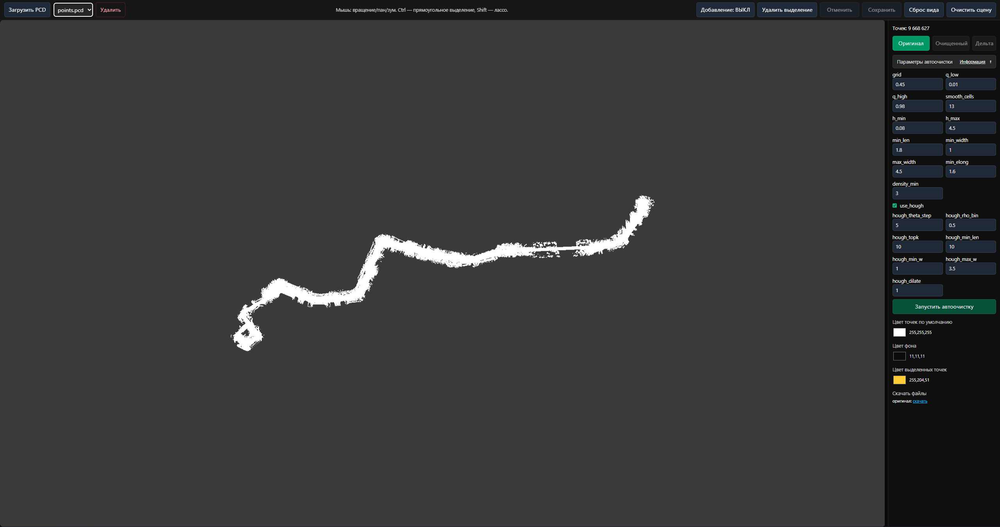

## Описание кнопок интерфейса

### Верхняя панель
- **Загрузить PCD**: открывает системный диалог выбора файла `.pcd`. Во время загрузки надпись меняется на «Загрузка…». Выбранный файл мгновенно показывается локально и параллельно отправляется на сервер.
- **Селектор файлов** (выпадающий список): позволяет выбрать один из ранее загруженных файлов для просмотра/обработки.
- **Удалить**: удаляет выбранный файл со всеми данными (оригинал, очищенный, дельта) из хранилища и записи из БД. Требует подтверждения во всплывающем диалоге.
- **Добавление: ВКЛ/ВЫКЛ**: включает режим добавления точек по клику в сцене (расчёт z по медиане ближайших n соседей). В режиме `delta` недоступно.
- **Удалить выделенное**: удаляет из текущего облака все точки, попавшие в выделение (прямоугольником или лассо). Недоступно в режиме `delta`.
- **Отменить**: отменяет последнюю операцию удаления точек (одноуровневое Undo). Активируется, когда возможна отмена. Горячая клавиша: `Ctrl+Z` (поддерживается по физическому коду клавиши `KeyZ`).
- **Сохранить**: отправляет текущее состояние облака на сервер. Если активен `original`, перезаписывает оригинал; если `cleaned` — перезаписывает очищенную версию. В режиме `delta` недоступно.
- **Сброс вида**: возвращает камеру к обзору текущего облака целиком.
- **Очистить сцену**: убирает облако точек со сцены (без удаления данных на сервере).

Подсказка по мыши в центре панели: «Мышь: вращение/пан/зум. Ctrl — прямоугольное выделение, Shift — лассо» — поясняет управление сценой.

### Боковая панель
- **Оригинал / Очищенный / Дельта**: три кнопки переключения варианта просмотра. `Очищенный` и `Дельта` активны, когда соответствующие данные доступны на сервере.
- **Параметры автоочистки**: секция раскрывается по клику. Внутри — поля настройки алгоритма (grid, квантильные пороги, высоты, размеры, Hough‑параметры и др.).
  - Кнопка **Информация**: открывает модальное окно с текстовым описанием параметров.
  - Поля ввода и чекбокс `use_hough`: меняют параметры, которые будут отправлены при старте автоочистки.
- **Запустить автоочистку**: отправляет запрос на сервер на обработку текущего файла с выбранными параметрами. На время операции показывается прелоадер с текстом «Загрузка... Процесс может занять несколько минут».
- Секции **Цвет точек по умолчанию / Цвет фона / Цвет выделенных точек**: содержат элементы выбора цвета.
- **Скачать файлы**: ссылки для скачивания `оригинал`, `очищенный`, `дельта`.

### Режим `delta`
- В верхней панели вместо набора редактирования доступна кнопка **Восстановить выделенное**: загружает очищенное облако и добавляет в него выделенную часть из дельты (удалённые ранее точки). Полезно для точечного отката удаления.

## Главный экран
  
  